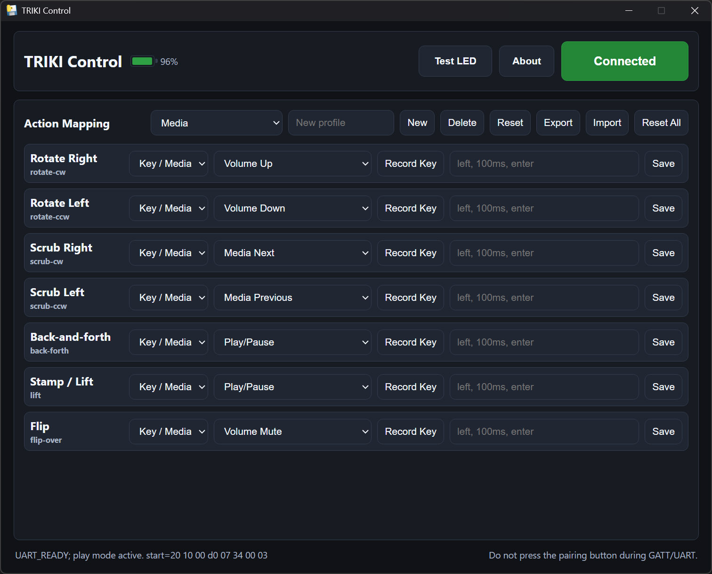

# TRIKI Control



  

**Play PC games by waving a bottle cap around.**

TRIKI is a little Bluetooth motion cap that Żabka sold as a toy for a kids' phone app. TRIKI Control is an independent desktop app that pairs with the cap, reads its motion over Bluetooth, and turns your wrist into a keyboard. Twist, tilt, tap and flip the cap and it presses keys, so the cap can drive anything: a browser game, a media player, a slideshow, or, yes, an entire run through **Doom**.

No drivers, no account. One pairing button, a few profiles to tweak, and the cap is a controller.

> **Heads up:** read [How it works](docs/how-it-works.md) first if you expect a normal joystick. A round cap with the sensors it has *cannot* know which way is "forward", so the controls work like a tank, not a gamepad. That is a physics limit, not a bug, and the whole story is below.

---

## Table of contents

- [The 30-second pitch](#the-30-second-pitch)
- [Controls](#controls)
- [Why does it steer like a tank?](#why-does-it-steer-like-a-tank)
- [Quick start](#quick-start)
- [Profiles](#profiles)
- [Building from source](#building-from-source)
- [Platform notes](#platform-notes)
- [Documentation](#documentation)
- [Credits, trademarks, license](#credits)

---

## The 30-second pitch

The cap is a smooth, round disc with a 6-axis motion sensor (a gyroscope and an accelerometer) and a Bluetooth radio. It has no buttons, no marked front, and no magnetometer, so it genuinely does not know which way it is pointing. TRIKI Control takes the raw motion stream, figures out *what you are doing with it* (twisting? tilting? tapping it on the desk?), and fires a key for each move.

Out of the box it ships with two ready profiles, **Game** (built for shooters like Doom) and **Music** (volume / play-pause), plus an Advanced panel where you can remap every move to any key, media key, or short macro.

## Controls

The default **Game** profile is a rotation-invariant "tank" scheme. Every control works no matter how the cap happens to be turned, so you never have to "aim" the cap first:

| Do this with the cap | In the game |
| --- | --- |
| **Twist** it flat on the table, left or right | **Turn** left / right |
| **Tilt** it in any direction and hold | **Walk forward** |
| **Tap** it straight down on the desk | **Fire** |
| **Flip** it upside-down | **Run** (holds Shift) |
| **Slide** it flat across the desk | **Use / open door** |

Two tips that make it click:

- **Steer and walk are separate moves.** Twist *or* tilt, not both at once. Twist to aim, then tilt to go. It feels like driving a tank, because it basically is one.
- **Shoot clean.** A fire-tap is a flat, straight-down knock on the table. If you twist while you tap, the cap reads it as a turn instead, so keep the tap square.

Every binding is editable in **Advanced > Action Mapping**, and there is a **Turn sensitivity** slider if steering feels too eager or too stiff.

## Why does it steer like a tank?

Short version: **I tried hard to give it normal "push-left-go-left" controls, and it is physically impossible with this hardware.** Here is the honest reason.

The cap has *two* sensors: a gyroscope (how fast it is rotating) and an accelerometer (which way gravity is pulling, plus any shove). That is a "6-axis IMU". What it is *missing* is a third sensor, a **magnetometer**, a compass. Phones and real game controllers have one; this toy does not, and there is no magnet inside to fake it.

Without a compass, and with no marked front on a perfectly round cap, there is **no way to recover heading**, the direction the cap is pointing in the real world. The gyro tells you it is *turning*, but a tiny, unavoidable error builds up every second and the estimate drifts away within moments. So "north" is unknowable. And if you cannot tell north from south, you cannot build a control where *pushing left always goes left*, because "left" keeps changing as the cap rotates in your hand.

You can see the same wall in the official Żabka games: every one of them is built around a *single* axis of motion. That is not a lack of ambition. The instant the cap is asked to track two things at once, the signals smear together, the noise wins, and it can no longer tell which one you meant. One clean axis is all the hardware reliably gives.

So the way out is to only use signals that **do not depend on heading**: how much it twists (not which way it ends up facing), how far it tilts (not in which world-direction), a sharp downward tap, an upside-down flip, a flat slide. Those are all heading-free, so they work however the cap is turned. That is the tank scheme, and it is the most controllable thing I could wring out of two sensors. With a magnetometer or a magnet glued inside, a full directional joystick would be straightforward; without one, this is the ceiling.

The long version, with the math and the dead ends, is in **[docs/how-it-works.md](docs/how-it-works.md)**.

## Quick start

### Run it (Windows)

1. Grab `TRIKI-Control.exe` from the [**Releases**](https://github.com/koksny/TRIKI-Control/releases) page and run it. (Windows SmartScreen may warn about an unknown publisher; it is an unsigned hobby build, so choose "More info > Run anyway".)
2. The app opens its own little window. If it does not, open **http://127.0.0.1:8766/** in a browser.
3. Click **Connect**, then press the cap's **physical button once** when asked.
4. Wait for the button to turn green and read **Connected**. Hold **Test LED** to confirm the cap is listening.
5. Pick a game (or leave it on the default), flip **Output ON**, click into your game, and play.

That is it. No install, and the config lives in a single JSON file next to the app.

### Run it from Python

See [Building from source](#building-from-source) if you would rather run the code directly or build your own executable.

## Profiles

- **Game** is the tank scheme above, run by the body-frame motion engine. This is the one built and tuned for actually playing through Doom.
- **Music** is a set of discrete one-shot gestures run by a separate classifier: twist for volume, a tap for play/pause, a flip for mute. Better for the couch than the battlefield.

Profiles can be selected, edited, exported, imported, reset one at a time, or reset as a whole set. Bindings accept single keys (`w`, `left`, `enter`, `space`, `=`), media keys (`volume-up`, `media-play-pause`), and short macros (`left, 100ms, enter`).

There is a hidden diagnostics page at **http://127.0.0.1:8766/debug** and a raw JSON feed at **/diagnostics** if you ever need to see what the cap is actually sending.

## Building from source

You need Python 3.11+ and the cap. Full per-platform instructions (including the PyInstaller specs that produce the standalone executables) are in **[docs/build.md](docs/build.md)**. The short version:

```bash
python -m venv .venv
# Windows:  .\.venv\Scripts\python.exe -m pip install -r requirements.txt
# macOS/Linux:  source .venv/bin/activate && pip install -r requirements.txt
python src/triki_app.py
```

The application modules live under `src/` as flat `triki_*.py` files. Start at `src/triki_app.py` (the UI and BLE loop) and `src/triki_motion_engine.py` (the tank-scheme controller that took most of the tuning).

## Platform notes

- **Windows.** Keyboard output uses `SendInput` (scancodes for normal keys, virtual-key events for media keys). A few games with aggressive anti-cheat ignore synthetic input; most do not.
- **macOS.** Output goes through Quartz/CoreGraphics and needs **Accessibility** permission (System Settings > Privacy & Security > Accessibility). The packaged app carries the Bluetooth usage strings CoreBluetooth requires.
- **Linux.** Keyboard output is written to `/dev/uinput`, which needs the right permissions; the BLE UI also needs a system WebKit/Qt backend that pip cannot install. See [docs/linux.md](docs/linux.md).

## Documentation

- [How it works](docs/how-it-works.md): the two-sensor problem, heading drift, why the official games are single-axis, and the rotation-invariant control design.
- [Controls & play guide](docs/controls.md): every move, what it binds to, and how to get clean input.
- [Building & packaging](docs/build.md): dev setup and standalone builds for all three platforms.
- [BLE protocol notes](docs/protocol.md): service UUIDs, the stream-start commands, the LED command, and the six motion channels.
- [Linux notes](docs/linux.md): uinput and the GUI backend.

## Credits

Made by **[Wojciech "Koksny" Górny](https://koksny.com)**.

The cap itself is `Triki` / model `CAP001`, produced by Caps Apps and distributed by Żabka.

### Trademarks & affiliation

TRIKI Control is an independent, open-source project. It is **not** affiliated with, endorsed by, or sponsored by Caps Apps, Żabka, or their partners. "TRIKI", "Żabka", and related names and logos belong to their respective owners. This project ships none of their software or assets, only an original, clean-room reimplementation of how to talk to the cap over standard Bluetooth.

## License

Released under the [MIT License](LICENSE).
